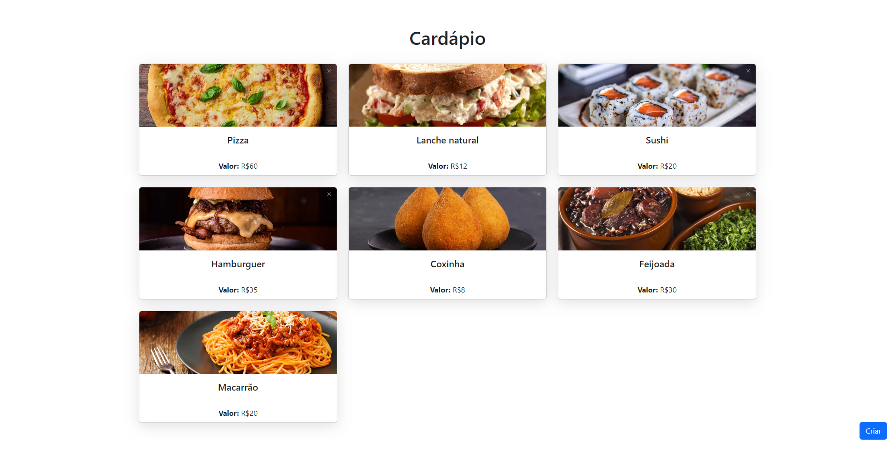
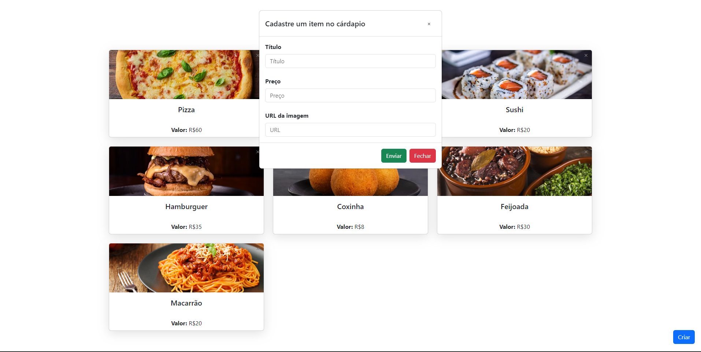

# Cardápio Digital - Frontend

Este projeto é um simples simples protótipo de um Cardápio Digital. A aplicação foi desenvolvida usando **Vue**.

<h1 align="center">
    
    
</h1>

## Requisitos

Antes de iniciar, você deve ter o Node.js e o NPM instalados em sua máquina.

## Instalando

Primeiro, você deve clonar o projeto na sua máquina, para isso você
pode colar o seguinte comando em seu terminal

```bash
git clone https://github.com/henrylacava/frontend-cardapio-digital.git
cd frontend-cardapio-digital
```

Para instalar as dependências, execute o seguinte comando:

```bash
npm install
```

Por fim, para executar o projeto basta rodar o seguinte:

```bash
npm run dev
```

## Integração com Backend

Para realizar a integração com o Backend, você pode clonar o projeto e rodar localmente, ou desenvolver você mesmo.

👉 [Link do repositório](https://github.com/henrylacava/backend-cardapio-digital)
